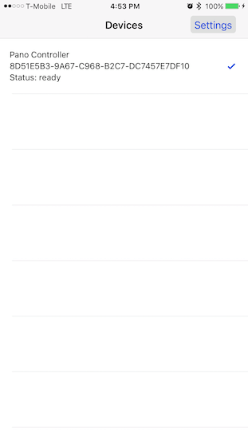
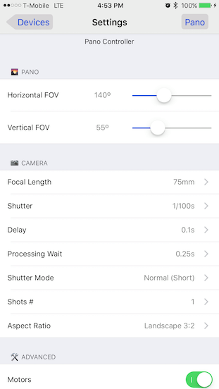
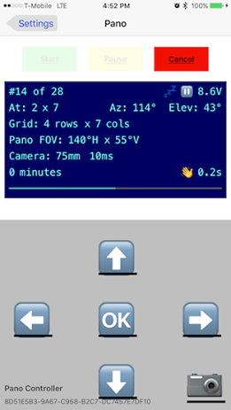

# PanoController-iOS

iOS PanoController App 1.0
==========================

Fully functional configuration and control of the Pano Platform over BLE.

Features
========

- Configuration: All the menu functions were migrated into the app
  - Focal Length, Shutter, Aspect Ratio, pre- and post- shutter delay, multi-shot mode, aspect ratio
  - Pano horizontal and vertical size
  
- Status screen shows all the information in the Arduino OLED display
- *Start* button starts the pano after setting up an initial position.
- *Cancel* function ends the pano
- *Pause* function enters manual mode:
  - Shutter can be triggered manually with auto advance to next position
  - Platform can be repositioned in all four directions respecting original grid alignment

Requirements
============

This app is part of a system. It is intended to connect and control the <a href="/laurb9/PanoController-Arduino">Arduino-based panorama platform</a> (version 2.1)

Building
========

Requires OS X and Xcode.
1. Load PanoController project
2. Connect iphone and select your phone as build target
3. Run (xcode might have to do some housekeeping the first time to be able to install the app to the phone)
